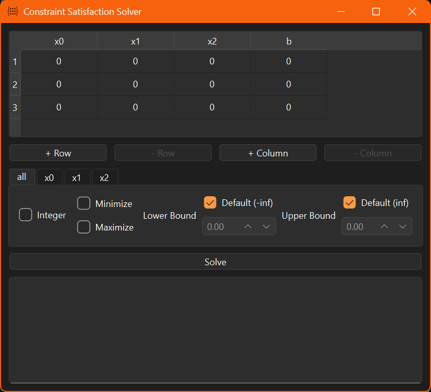

# Constraint Satisfaction Solver

This project provides a way to solve a system of linear equations with constraints applied on it.
This is done via a user-friendly Graphical User Interface (GUI). Through the GUI, the system be
given new equations and new variables (with no upper limit on either), and the constraints can be
applied in both a fine-grained (per variable) way and in a global (all variables) way. The available
constraints are Integral, Minimized, Maximized, Lower-Bounded, and Upper-Bounded.

The purpose of this project is to showcase the value of highly clean, maintainable code. This is
often not prioritized in Python projects due to the free nature of the language. Hopefully, the code
in this project can show that Python's freedom can be enjoyed without sacrificing on cleanliness or
correctness and also without over-engineering.

The functionality of this project, as well as the user-friendly GUI, is also hoped to have real-life
useful in itself without a need to work with any of the code.

## Getting Started

This section will guide you on how to be able to work with the code and run the project. If you do
not want to make your own executable, you can skip the [Making an Executable](#making-an-executable)
section.

If you simply want to use this project with no intention of changing any code, you only need to have
Git installed and to follow step 1 and 2 of the [Installing](#installing) section. You can then
refer to the executable when going through the [How To Use](#how-to-use) section.

### Pre-Requisites

The following software must be installed to follow the installation steps:

* Git - [How to install Git](https://git-scm.com/book/en/v2/Getting-Started-Installing-Git)
* Python - [How to install Python](https://www.python.org/downloads)

### Installing

Following the upcoming steps will result in you having a local version of the project that you can
modify.

1. Start by copying this repository into a local folder:
    ```
    git clone github.com/alias012/constraint-satisfaction-solver
    ```

2. Enter the new `constraint-satisfaction-solver` directory:
    ```
    cd constraint-satisfaction-solver
    ```

3. Make a new virtual environment
    ```
    python -m venv .venv
    ```

4. [Activate the virtual environment](https://docs.python.org/3/library/venv.html#how-venvs-work)

5. Install the required packages
    ```
    pip install -r requirements.txt
    ```

6. Follow the [How To Use](#how-to-use) section and enjoy!

#### Making an Executable

This section should only be followed if you desire to make an executable for the project.

1. Install the packager - [PyInstaller](https://pyinstaller.org/en/stable/index.html)
    ```
    pip install pyinstaller
    ```

2. Package the project
    ```
    pyinstaller --clean --noconfirm --add-data="src/resources/matrix.ico:." --icon="src/resources/matrix.ico" src/main.py
    ```

3. You can now run the executable `main.*OS-DEPENDENT*` in `./dist/main/`

n.b. The executable must stay where it is, up until the `dist` directory. If you want to send the
executable to another device, it is recommended to compress the `dist` directory and send it as a
whole.

n.b. The executable is OS-Dependent, and thus must be packaged again if wanted to be used on an OS
different from the OS of the original packager. The executable in this repository is made for
Windows.

## How To Use

Whether you intend to use `main.py` file or the executable version, the following instructions are
the same; the only difference being in the first step.

1. Run the program<sup>a</sup>
    * If using `main.py`:
        ```
        python src/main.py
        ```
    * If using the executable, simply run the executable. On windows, this is done like:
       ```
       .\dist\main\main.exe
       ```

2. The GUI will now pop up after some moments
   

3. An explanation of the interface follows:
    * The table is used to input your system of equations. Simply click on a cell within the table
      and input any numerical value.
    * The `+ Row` button will add a new empty row to the bottom of the table.
    * The `- Row` button will remove the rows that you have selected. To select a row, click the row
      numbers on the side of the table. A system of equations with no equations (rows) would serve
      no purpose, thus the button will be disabled if all rows are selected.
    * The `+ Column` button will add a new empty column 1 position before the `b` column
    * The `- Column` button will remove the columns that you have selected. To select a column,
      click the column numbers on the top of the table. A system of equations with no variables
      (columns) or target values (the `b` column) would serve no purpose, thus the button will be
      disabled if all <code>x<sub>i</sub></code> columns or the `b` column is selected.
    * The tabs are used to apply constraints when looking for a solution to the system of equations.
      The <code>x<sub>i</sub></code> tab applies constraints on the <code>x<sub>i</sub></code>
      column. The `all` tab updates all <code>x<sub>i</sub></code> tabs to have same constraints,
      thus if you have many tabs and want to save time when defining the same constraint in each
      one, you can define the constraint in the `all` tab. You can easily override the `all` tab by
      going to a specific <code>x<sub>i</sub></code> tab and defining the new constraint there,
      which does not affect the `all` tab or any other <code>x<sub>i</sub></code> tabs<sup>b</sup>.
        * `Integer` checkbox: the affected variable is restricted to be an integer.
        * `Minimize` checkbox: the solution will be optimized to minimize the affected variable as
          much as possible<sup>c</sup>. Mutually excluded from `Maximize` checkbox.
        * `Maximize` checkbox: the solution will be optimized to maximize the affected variable as
          much as possible<sup>c</sup>. Mutually excluded from `Minimize` checkbox.
        * Lower bound: the affected variable will be no smaller than the lower bound (inclusively).
          The `Default` checkbox can be selected to define the lower bound as negative infinity, or
          the input box can be used to enter any numeric value.
        * Upper bound: the affected variable will be no larger than the lower bound (inclusively).
          The `Default` checkbox can be selected to define the upper bound as positive infinity, or
          the input box can be used to enter any numeric value.
        * `Solve` button: the system of equation and constraints will be processed and the result
          will be output into the text box below.

4. You are now well-equipped to use this Constraint Satisfaction Solver. May it be of good use!

<sup>a</sup> You can also use the `--file` flag, or `-f` for short, to define a path to a
CSV-formatted file to load into the table when the application first starts up. For example:

```
python src/main.py -f src/resources/examples/how_to_use.txt
```

<sup>b</sup> More technically put, when solving commences, the constraints are taken from the
<code>x<sub>i</sub></code> tabs, not the `all` tab, so only the state of the
<code>x<sub>i</sub></code> tabs affect the solution.

<sup>c</sup> Minimization and maximization may not be a defined operation when the lower bound is
negative infinity or the upper bound is positive infinity, respectively. This is the case when the
system has no true minimum/maximum when dealing with positive/negative infinity.

### Example Usage

The prime application of this project is likely with some form of scheduling and/or resource
allocation problem. An example is given below on how this project can be used in a real-life
scenario:

A factory makes four products (<code>x<sub>0</sub></code>-<code>x<sub>3</sub></code>) over a
given time period (e.g. one week). Each product requires resources in the process of making it:

* Machine-Hours
* Man-Hours

In a given week, the factory has a limit on availability of these resources which it cannot exceed,
but it is in its best interest to use the resource in its entirety (e.g. if `x` amount of man-hours
are employed each week, then the factory should expect `x` man-hours to be worked; no more and no
less.)

The factory has a weekly minimum quota for each product. It also, does not want to leave a product
partially finished, that way each week starts clean and there is an accurate representation of how
many products can be made in a single week.

In order to maximize margin, it wants to make as many of <code>x<sub>3</sub></code> as it can while
still meeting the minimum quota (e.g. 5) and resource requirements for the other products.

This context can be modeled such as with `src/resources/examples/example_usage.txt` file. Each row
shows the consumption of a resource, with each column (besides the last) representing the
resource consumption of a type of product, and the last column showing the total available resource.
In this case, the first row indicates the machine-hour resource and the second row indicates the
man-hour resource.

We can load this context into the application by doing the following steps:

1. Run the application with the example input:
    ```
    python src/main.py -f src/resources/examples/example_usage.txt
    ```

2. In the `all` tab, select `Integer`, since we do not want to have any "partial" products.
3. In the `all` tab, unselect the `default` lower bound and set the input box to `5` (the minimum
   quota).
4. In the <code>x<sub>3</sub></code> tab, select `Maximize`.
5. Click `Solve`.

Now the factory can see that it can make 8 <code>x<sub>0</sub></code>, 6
<code>x<sub>1</sub></code>, 5 <code>x<sub>2</sub></code>, and 33 <code>x<sub>3</sub></code>
products!

## Built With

* [SciPy](https://scipy.org/) - Optimization & Linear Algebra
* [NumPy](https://numpy.org/) - Data Representation, Linear Algebra & Mathematical Tools
* [PySide6](https://www.qt.io/development/qt-framework/python-bindings) - GUI Framework

## Contributing

If you desire to contribute to this project, please start by making an issue on this repository
describing the contribution you have in mind. After that, you can fork this repository, write and
commit the changes you previously described, and finish with a pull request.

## Authors

* **Andrew Lia**:
  [GitHub](https://github.com/lia-andrew) - [LinkedIn](https://linkedin.com/in/andrew-lia)

## License

This project is licensed under the MIT License - see the [LICENSE.md](LICENSE.md) file for details.

## Acknowledgments

[Application icon](src/resources/matrix.ico) made by <b>afif fudin</b> from
<a href="https://www.flaticon.com">www.flaticon.com</a>

## Keywords

Python, SciPy, NumPy, PySide6, Mixed Integer Linear Programming (MILP), Constraint Satisfaction
Problem, Clean Code, Maintainable Code, Self-Documenting Code, Documentation, Separation of
Concerns.
